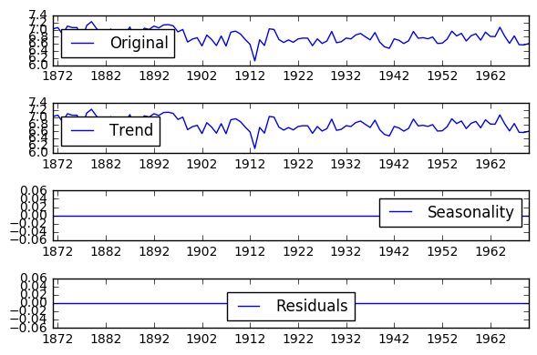
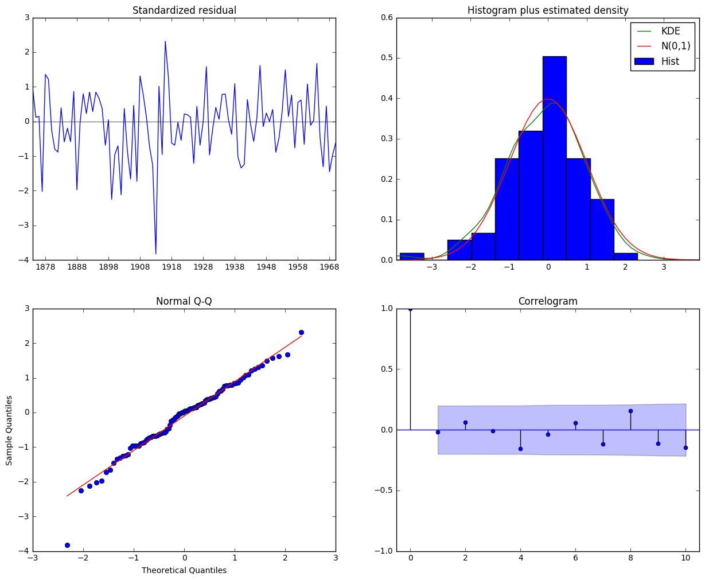
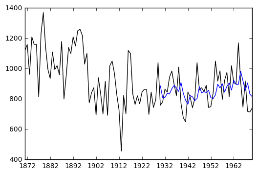
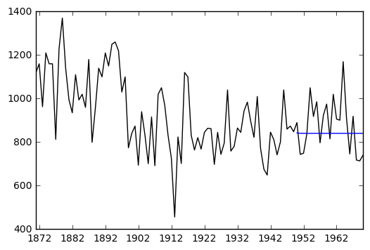

# Source of reference: https://www.digitalocean.com/community/tutorials/a-guide-to-time-series-forecasting-with-arima-in-python-3


```python
import warnings
import itertools
import pandas as pd
import numpy as np
import statsmodels.api as sm
import matplotlib.pyplot as plt
%matplotlib inline
```


```python
#show datasets avaialble
dir(sm.datasets)
```


    ['__builtins__',
     '__cached__',
     '__doc__',
     '__file__',
     '__loader__',
     '__name__',
     '__package__',
     '__path__',
     '__spec__',
     'anes96',
     'cancer',
     'ccard',
     'check_internet',
     'china_smoking',
     'clear_data_home',
     'co2',
     'committee',
     'copper',
     'cpunish',
     'elnino',
     'engel',
     'fair',
     'fertility',
     'get_data_home',
     'get_rdataset',
     'grunfeld',
     'heart',
     'longley',
     'macrodata',
     'modechoice',
     'nile',
     'randhie',
     'scotland',
     'spector',
     'stackloss',
     'star98',
     'statecrime',
     'strikes',
     'sunspots',
     'utils',
     'webuse']


```python
nile= sm.datasets.nile.load_pandas()
```


```python
#load the dataset into Dataframe
data=nile.data
```


```python
data.volume.values
```


    array([ 1120.,  1160.,   963.,  1210.,  1160.,  1160.,   813.,  1230.,
            1370.,  1140.,   995.,   935.,  1110.,   994.,  1020.,   960.,
            1180.,   799.,   958.,  1140.,  1100.,  1210.,  1150.,  1250.,
            1260.,  1220.,  1030.,  1100.,   774.,   840.,   874.,   694.,
             940.,   833.,   701.,   916.,   692.,  1020.,  1050.,   969.,
             831.,   726.,   456.,   824.,   702.,  1120.,  1100.,   832.,
             764.,   821.,   768.,   845.,   864.,   862.,   698.,   845.,
             744.,   796.,  1040.,   759.,   781.,   865.,   845.,   944.,
             984.,   897.,   822.,  1010.,   771.,   676.,   649.,   846.,
             812.,   742.,   801.,  1040.,   860.,   874.,   848.,   890.,
             744.,   749.,   838.,  1050.,   918.,   986.,   797.,   923.,
             975.,   815.,  1020.,   906.,   901.,  1170.,   912.,   746.,
             919.,   718.,   714.,   740.])


```python
tp=[]

for i in range(len(data)):
    
        timepoint=data.iloc[i]['year'].astype(int).astype(str) + '-'+'01-01'
        tp.append(timepoint)
```


```python
vol_data=pd.DataFrame({'Volume':data.volume.values}, index=pd.to_datetime(tp))
```


```python
vol_data.head()
```


<div>
<table border="1" class="dataframe">
  <thead>
    <tr style="text-align: right;">
      <th></th>
      <th>Volume</th>
    </tr>
  </thead>
  <tbody>
    <tr>
      <th>1871-01-01</th>
      <td>1120.0</td>
    </tr>
    <tr>
      <th>1872-01-01</th>
      <td>1160.0</td>
    </tr>
    <tr>
      <th>1873-01-01</th>
      <td>963.0</td>
    </tr>
    <tr>
      <th>1874-01-01</th>
      <td>1210.0</td>
    </tr>
    <tr>
      <th>1875-01-01</th>
      <td>1160.0</td>
    </tr>
  </tbody>
</table>
</div>


```python
vol_data.plot(figsize=(15, 6))
plt.show()
```


# look at decompositional element. 


```python
from statsmodels.tsa.seasonal import seasonal_decompose

#take the log of the volumne data to make it more of a normal distribution
decomposition = seasonal_decompose(np.log(vol_data))
trend = decomposition.trend
seasonal = decomposition.seasonal
residual = decomposition.resid

```


```python
plt.subplot(411)
plt.plot(np.log(vol_data), label='Original')
plt.legend(loc='best')
plt.subplot(412)
plt.plot(trend, label='Trend')
plt.legend(loc='best')
plt.subplot(413)
plt.plot(seasonal,label='Seasonality')
plt.legend(loc='best')
plt.subplot(414)
plt.plot(residual, label='Residuals')
plt.legend(loc='best')
plt.tight_layout()

```





# No seasonality detected. To find optimal parameters for sarimax time series model, set up a grid search.


```python
p = d = q = range(0, 2)

# Generate all different combinations of p, q and q triplets
pdq = list(itertools.product(p, d, q))

# Generate all different combinations of seasonal p, q and q triplets
seasonal_pdq = [(x[0], x[1], x[2], 12) for x in list(itertools.product(p, d, q))]

print('Examples of parameter combinations for Seasonal ARIMA...')
print('SARIMAX: {} x {}'.format(pdq[1], seasonal_pdq[1]))
print('SARIMAX: {} x {}'.format(pdq[1], seasonal_pdq[2]))
print('SARIMAX: {} x {}'.format(pdq[2], seasonal_pdq[3]))
print('SARIMAX: {} x {}'.format(pdq[2], seasonal_pdq[4]))
```

    Examples of parameter combinations for Seasonal ARIMA...
    SARIMAX: (0, 0, 1) x (0, 0, 1, 12)
    SARIMAX: (0, 0, 1) x (0, 1, 0, 12)
    SARIMAX: (0, 1, 0) x (0, 1, 1, 12)
    SARIMAX: (0, 1, 0) x (1, 0, 0, 12)
    


```python
warnings.filterwarnings("ignore") # specify to ignore warning messages

for param in pdq:
    for param_seasonal in seasonal_pdq:
        try:
            mod = sm.tsa.statespace.SARIMAX(np.log(vol_data),
                                            order=param,
                                            seasonal_order=param_seasonal,
                                            enforce_stationarity=False,
                                            enforce_invertibility=False)

            results = mod.fit()

            print('ARIMA{}x{}12 - AIC:{}'.format(param, param_seasonal, results.aic))
        except:
            continue
```

    ARIMA(0, 0, 0)x(0, 0, 1, 12)12 - AIC:500.3253707784356
    ARIMA(0, 0, 0)x(0, 1, 1, 12)12 - AIC:-15.002974230655422
    ARIMA(0, 0, 0)x(1, 0, 0, 12)12 - AIC:-10.845892328459849
    ARIMA(0, 0, 0)x(1, 0, 1, 12)12 - AIC:-30.436467640234355
    ARIMA(0, 0, 0)x(1, 1, 0, 12)12 - AIC:-11.555765139808228
    ARIMA(0, 0, 0)x(1, 1, 1, 12)12 - AIC:-15.858251913484871
    ARIMA(0, 0, 1)x(0, 0, 0, 12)12 - AIC:531.888905163303
    ARIMA(0, 0, 1)x(0, 0, 1, 12)12 - AIC:386.81945792953263
    ARIMA(0, 0, 1)x(0, 1, 0, 12)12 - AIC:-11.153708233957529
    ARIMA(0, 0, 1)x(0, 1, 1, 12)12 - AIC:-24.96722312324776
    ARIMA(0, 0, 1)x(1, 0, 0, 12)12 - AIC:-12.820225589303263
    ARIMA(0, 0, 1)x(1, 0, 1, 12)12 - AIC:-7.2492131661396435
    ARIMA(0, 0, 1)x(1, 1, 0, 12)12 - AIC:-17.44245615456768
    ARIMA(0, 0, 1)x(1, 1, 1, 12)12 - AIC:-21.662877329308497
    ARIMA(0, 1, 0)x(0, 0, 1, 12)12 - AIC:-37.555668300937036
    ARIMA(0, 1, 0)x(0, 1, 1, 12)12 - AIC:-15.491188733740213
    ARIMA(0, 1, 0)x(1, 0, 0, 12)12 - AIC:-38.748298067057696
    ARIMA(0, 1, 0)x(1, 0, 1, 12)12 - AIC:-35.615560770148
    ARIMA(0, 1, 0)x(1, 1, 0, 12)12 - AIC:5.698988977219167
    ARIMA(0, 1, 0)x(1, 1, 1, 12)12 - AIC:-7.9120698368811215
    ARIMA(0, 1, 1)x(0, 0, 0, 12)12 - AIC:-72.30712907240154
    ARIMA(0, 1, 1)x(0, 0, 1, 12)12 - AIC:-59.2018114019037
    ARIMA(0, 1, 1)x(0, 1, 0, 12)12 - AIC:-7.1549214144135735
    ARIMA(0, 1, 1)x(0, 1, 1, 12)12 - AIC:-31.693469023329676
    ARIMA(0, 1, 1)x(1, 0, 0, 12)12 - AIC:-62.09696091264061
    ARIMA(0, 1, 1)x(1, 0, 1, 12)12 - AIC:-57.30997339892333
    ARIMA(0, 1, 1)x(1, 1, 0, 12)12 - AIC:-15.403997672325985
    ARIMA(0, 1, 1)x(1, 1, 1, 12)12 - AIC:-24.344734233928854
    ARIMA(1, 0, 0)x(0, 0, 0, 12)12 - AIC:-43.18510110735455
    ARIMA(1, 0, 0)x(0, 0, 1, 12)12 - AIC:-36.835292306451684
    ARIMA(1, 0, 0)x(0, 1, 0, 12)12 - AIC:-13.837649086824964
    ARIMA(1, 0, 0)x(0, 1, 1, 12)12 - AIC:-33.74128886813366
    ARIMA(1, 0, 0)x(1, 0, 0, 12)12 - AIC:-36.878147402122934
    ARIMA(1, 0, 0)x(1, 0, 1, 12)12 - AIC:-34.640908950086846
    ARIMA(1, 0, 0)x(1, 1, 0, 12)12 - AIC:-19.591953600320952
    ARIMA(1, 0, 0)x(1, 1, 1, 12)12 - AIC:-27.43260097682949
    ARIMA(1, 0, 1)x(0, 0, 0, 12)12 - AIC:-71.71546557549023
    ARIMA(1, 0, 1)x(0, 0, 1, 12)12 - AIC:-58.93520789776957
    ARIMA(1, 0, 1)x(0, 1, 0, 12)12 - AIC:-13.776962364364945
    ARIMA(1, 0, 1)x(0, 1, 1, 12)12 - AIC:-34.53626801988043
    ARIMA(1, 0, 1)x(1, 0, 0, 12)12 - AIC:-60.563492106138185
    ARIMA(1, 0, 1)x(1, 0, 1, 12)12 - AIC:-54.0016479601604
    ARIMA(1, 0, 1)x(1, 1, 0, 12)12 - AIC:-19.47450504132724
    ARIMA(1, 0, 1)x(1, 1, 1, 12)12 - AIC:-28.71991461156157
    ARIMA(1, 1, 0)x(0, 0, 0, 12)12 - AIC:-61.00886709444421
    ARIMA(1, 1, 0)x(0, 0, 1, 12)12 - AIC:-53.55516667463787
    ARIMA(1, 1, 0)x(0, 1, 0, 12)12 - AIC:0.3994338987208228
    ARIMA(1, 1, 0)x(0, 1, 1, 12)12 - AIC:-24.569456994212924
    ARIMA(1, 1, 0)x(1, 0, 0, 12)12 - AIC:-53.76698709887258
    ARIMA(1, 1, 0)x(1, 0, 1, 12)12 - AIC:-51.87917735635104
    ARIMA(1, 1, 0)x(1, 1, 0, 12)12 - AIC:-5.933834326115097
    ARIMA(1, 1, 0)x(1, 1, 1, 12)12 - AIC:-19.112458940846267
    ARIMA(1, 1, 1)x(0, 0, 0, 12)12 - AIC:-73.57350719870367
    ARIMA(1, 1, 1)x(0, 0, 1, 12)12 - AIC:-60.338781390431066
    ARIMA(1, 1, 1)x(0, 1, 0, 12)12 - AIC:-8.168838962391622
    ARIMA(1, 1, 1)x(0, 1, 1, 12)12 - AIC:-33.71156153090305
    ARIMA(1, 1, 1)x(1, 0, 0, 12)12 - AIC:-59.04358549688331
    ARIMA(1, 1, 1)x(1, 0, 1, 12)12 - AIC:-59.17159315884642
    ARIMA(1, 1, 1)x(1, 1, 0, 12)12 - AIC:-16.221496009136462
    ARIMA(1, 1, 1)x(1, 1, 1, 12)12 - AIC:-25.273482792637516
    

Pick the model with the lowest AIC value. Lower AIC corresponds a model that fits the data very well while using fewer features.
ARIMA(1, 1, 1)x(0, 0, 0, 12)12 - AIC:-73.57350719870367


```python
mod = sm.tsa.statespace.SARIMAX(np.log(vol_data),
                                order=(1,1,1),
                                seasonal_order=(0, 0, 0, 12),
                                enforce_stationarity=False,
                                enforce_invertibility=False)
```


```python
results = mod.fit()
```


```python
print(results.summary().tables[1])

```

    ==============================================================================
                     coef    std err          z      P>|z|      [0.025      0.975]
    ------------------------------------------------------------------------------
    ar.L1          0.2268      0.132      1.717      0.086      -0.032       0.486
    ma.L1         -1.1422      0.070    -16.356      0.000      -1.279      -1.005
    sigma2         0.0196      0.004      5.559      0.000       0.013       0.026
    ==============================================================================
    


```python
results.plot_diagnostics(figsize=(15, 12))
plt.show()
```





standardized residual seems be stationary with mean centered around 0. In the histogram plot, the KDE should follow closely with the normal distribution N(0,1). Q-Q plot should be linear for normally distributed residuals. The correlogram in the bottom right shows whether or not the time series residuals have correlation with the previous data points. This plot indicates no correlation since all points are within the light blue confidence interval.

# In sample one-step-ahead prediction


```python
pred = results.get_prediction(start=str('1930-01-01'), dynamic=False)
pred_ci = pred.conf_int()
```


```python
vol_data.index=pd.to_datetime(vol_data.index)
```


```python
predictions_ARIMA=np.exp(pred.predicted_mean)
plt.plot(vol_data,'black')
plt.plot(predictions_ARIMA)
```


    [<matplotlib.lines.Line2D at 0xc823898>]





#  Try dynamic True. It only uses information from the time series up to a certain point, and after that, forecasts are generated using values from previous forecasted time points.


```python
pred_dynamic = results.get_prediction(start='1950-01-01', dynamic=True, full_results=True)
pred_dynamic_ci = pred_dynamic.conf_int()
```


```python
predictions_ARIMA=np.exp(pred_dynamic.predicted_mean)

plt.plot(vol_data, 'black')
plt.plot(predictions_ARIMA)
```


    [<matplotlib.lines.Line2D at 0xc8896a0>]





Accumulation of errors in dynamic forecasting makes it a poor choice in predicting future values since it plateaus quickly. ARIMA/SARIMA models don't seem to work too well on this Nile river dataset due to lack of strong trend or seasonality.


```python

```
